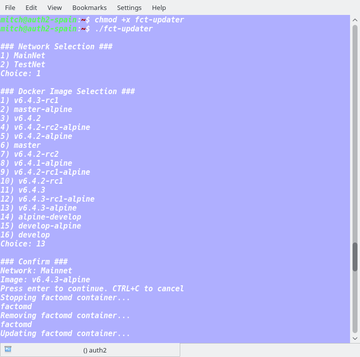

# FCT Updater

Fetchs a list of the latest image tags from docker hub, removes the old factomd container and installs the selected version for either Mainnet or Testnet.

Tested on Ubuntu. Assumes that the docker binary is located in the default location of `/usr/bin/docker`. If docker is located elsewhere modify the *docker_path* variable at the top of the script.


If the current user is not in the docker group run as sudo.

### Installation

```bash
wget https://raw.githubusercontent.com/kompendium-llc/fct-updater/master/fct-updater.py -O fct-updater &&
chmod +x fct-updater
```

### Usage

```bash
./fct-updater
```

### Example


