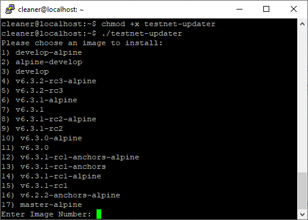

# FCT Updater

Fetchs a list of the latest docker images from docker hub, removes the old factomd container and runs the selected version.

Tested on Ubuntu. Assumes that the docker binary is located in the default location of `/usr/bin/docker`.

If user is not in the docker group run as sudo.

### Usage

```bash
wget https://raw.githubusercontent.com/kompendium-llc/fct-updater/master/fct-updater.py -O testnet-updater
chmod +x testnet-updater
./testnet-updater
```

### Example


